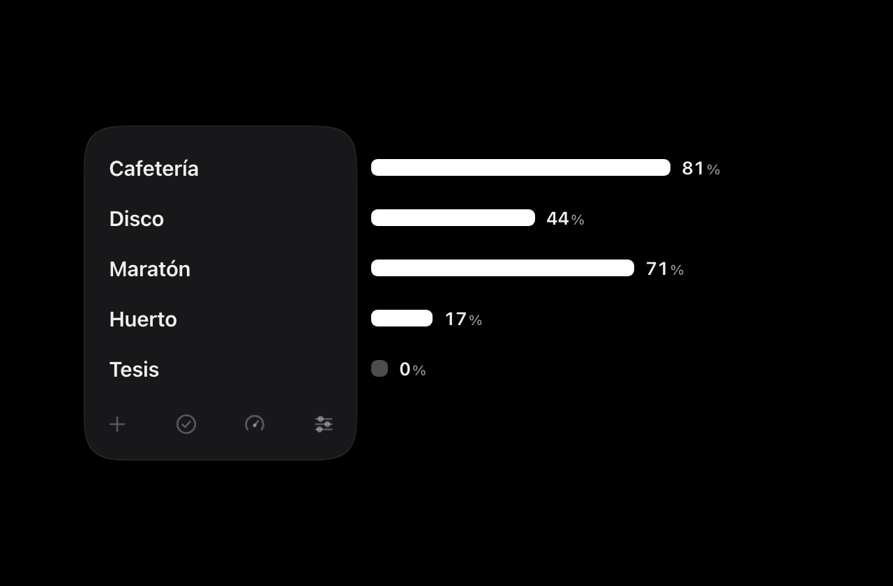
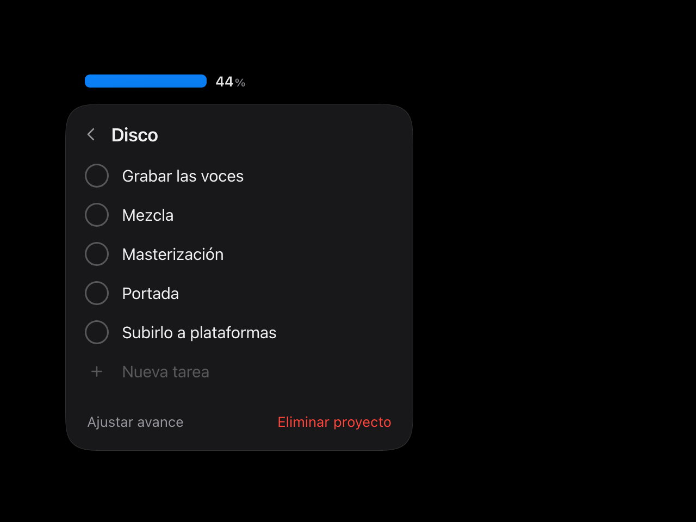
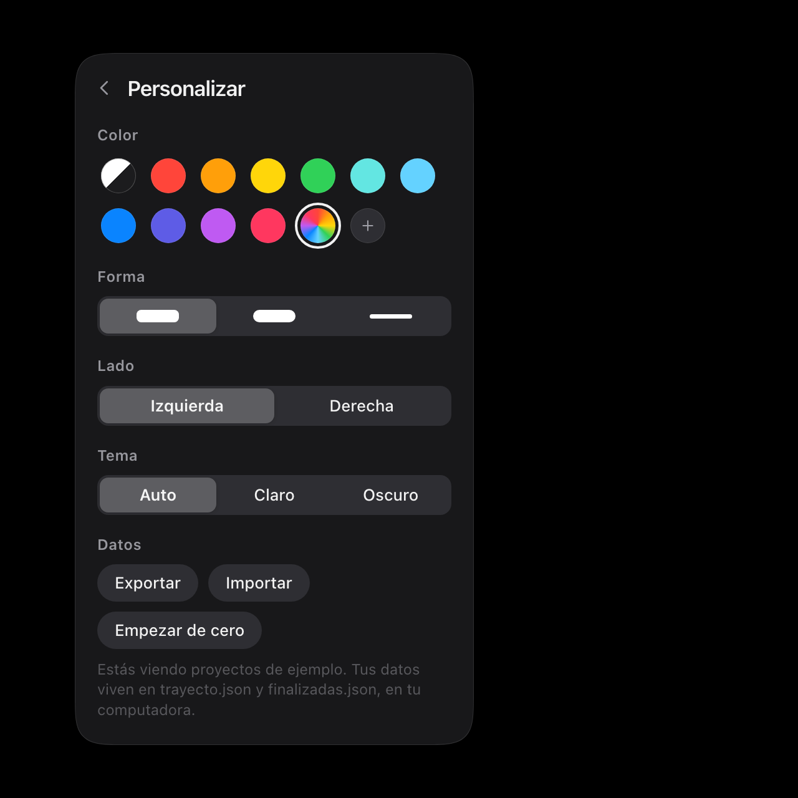
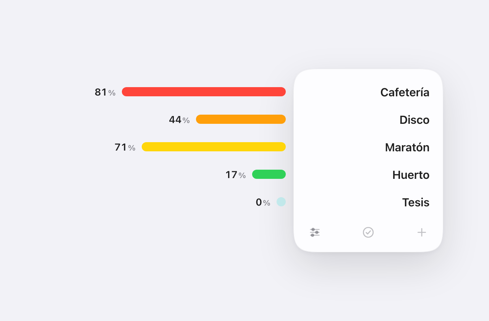
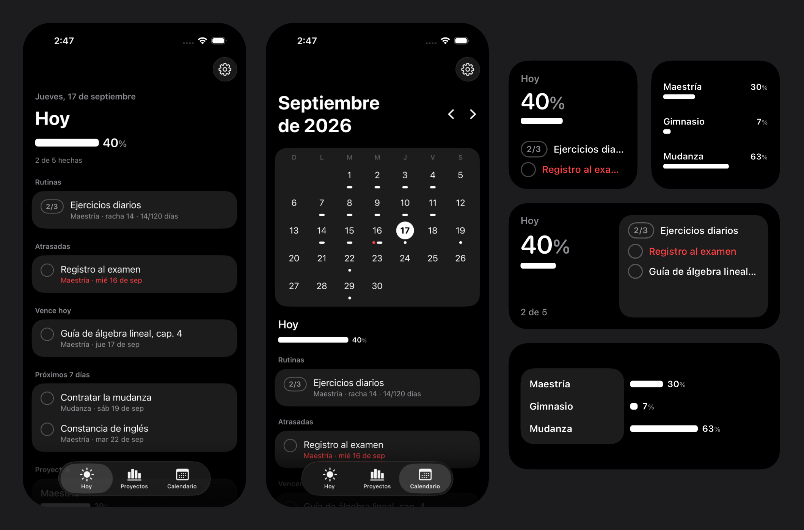
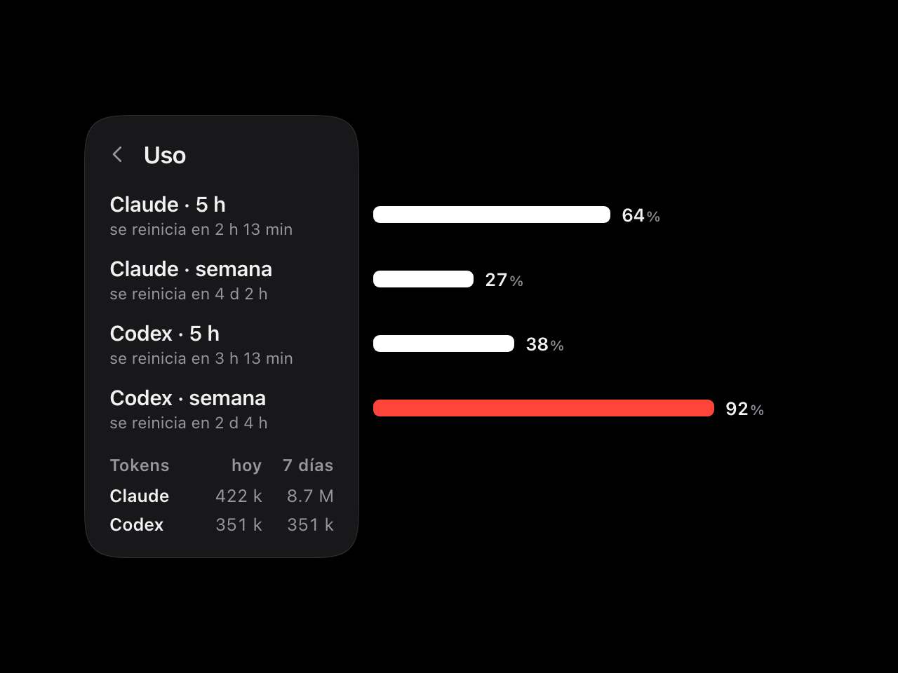

# Flecha

Tus proyectos y su avance, en una línea.

En reposo Flecha es solo eso: una línea vertical. La tocas y se abre en un cuadrado con los nombres de tus proyectos; las barras de avance se despliegan **por fuera** del cuadrado, cada una con su porcentaje al final. Nunca ves la barra completa, solo lo que llevas. Tocas un proyecto y aparecen sus faltantes. Cuando algo llega al 100 % desaparece, pero queda guardado en un archivo de finalizadas por si quieres revertirlo.



| Los faltantes de un proyecto | Personalizar, como una carátula de reloj |
| --- | --- |
|  |  |



Sin cuentas, sin nube, sin dependencias. Tus datos son dos archivos JSON en tu computadora (o el almacenamiento de tu navegador).

## Instalar

```sh
git clone https://github.com/AxelC-Reyes/flecha.git
cd flecha
```

Y eliges cómo usarlo:

### 1. En cualquier computadora (macOS, Windows, Linux)

```sh
./flecha            # Windows: flecha.bat
```

Solo necesita Python 3, que en macOS y Linux ya viene instalado. Abre Flecha en tu navegador y guarda tus datos en `~/.flecha/`.

- `./flecha --ventana` lo abre en una ventana sin barras (Chrome, Edge o Brave).
- `./flecha --red` lo comparte con tu red wifi para abrirlo desde el teléfono, con un enlace que lleva una clave.
- `./flecha --datos otra/carpeta` o la variable `FLECHA_DIR` cambian dónde viven los JSON.

### 2. Widget flotante en macOS

```sh
mac/construir.sh --abrir
```

Compila `mac/build/Flecha.app` (unos segundos; requiere `xcode-select --install`). La línea queda pegada al borde de tu pantalla, encima de todo, en todos los escritorios. Desde el ícono de la barra de menús puedes mandarla detrás de tus ventanas o salir. Para que arranque con tu Mac: Ajustes del Sistema → General → Ítems de inicio.

### 3. App y widgets para iPhone y iPad



En el teléfono Flecha no es una línea (iOS no deja que una app flote sobre la pantalla de inicio): es una app de deberes con los mismos proyectos y los mismos porcentajes.

- **Hoy**: el porcentaje de tu día, tus rutinas, lo que vence hoy, lo atrasado y lo que viene en la semana.
- **Proyectos**: cada uno con su barra; dentro, sus faltantes (con fecha límite opcional) y sus rutinas.
- **Calendario**: los días con entregas y los días en que cumpliste tus rutinas.
- **Rutinas**: cosas que se repiten, como "3 ejercicios diarios" o "gimnasio lunes, miércoles y viernes". Eliges cuántas veces al día, qué días tocan (los de descanso no rompen la racha) y, si quieres, una meta de días: con meta, cada día cumplido suma al avance del proyecto.
- **Widgets**: *Hoy* (con botones para sumar a una rutina o terminar una tarea sin abrir la app), *Avance* y *Uso*.

Para instalarla necesitas una Mac con Xcode y una cuenta de Apple (la gratuita sirve; con ella hay que reinstalar cada 7 días):

1. Abre `ios/Flecha.xcodeproj` en Xcode.
2. Crea `ios/Firma.local.xcconfig` con un prefijo tuyo y tu equipo (está explicado en `ios/Firma.xcconfig`), o elige tu equipo en *Signing & Capabilities* de los dos targets.
3. Conecta tu iPhone o iPad (con el Modo de desarrollador activo), elígelo arriba y pulsa ▶.

**Los mismos datos que en tu computadora**: en la computadora corre `./flecha --red` y copia el enlace que imprime (en la app de Mac: menú *Compartir con mi iPhone o iPad*). En el teléfono: engrane → pega el enlace → Conectar. Deben estar en la misma red wifi. Fuera de casa puedes seguir palomeando: los cambios se guardan en una cola y se entregan, sin pisar lo que haya cambiado la computadora, cuando vuelves a su red. El enlace lleva una clave (`~/.flecha/clave`; bórrala para generar otra). Sin conectar, la app lleva sus propios datos en el teléfono.

En la computadora las fechas límite y las rutinas también se ven y se registran (el contador `2/3` dentro de cada proyecto); crear rutinas, por ahora, solo desde el teléfono.

### 4. Sin instalar nada (teléfono incluido)

Abre `web/index.html` con doble clic, o publica la carpeta `web/` en cualquier hosting estático (este repo trae un flujo para GitHub Pages). En iPhone y Android: *Compartir → Agregar a pantalla de inicio* y se comporta como app, incluso sin conexión. En este modo los datos viven en el navegador; usa *Personalizar → Exportar* para respaldarlos.

## Usarlo

- **La línea** se abre con un toque. Se cierra tocando fuera o con `Esc`.
- **＋** crea un proyecto. Tocar su nombre abre sus faltantes.
- **El círculo** de una tarea la da por terminada: sale de la lista, la barra crece y la tarea pasa a *Finalizadas*. Hay *Deshacer* durante unos segundos.
- Borrar el texto de una tarea la quita, como en Recordatorios.
- **Ajustar avance** sirve para proyectos que ya iban empezados: dices en qué porcentaje van y a partir de ahí cada tarea terminada suma.
- **Finalizadas** (la palomita) es el archivo. La flecha regresa una tarea a pendientes; si su proyecto ya se había ido, regresa con ella.
- **Personalizar**: color de las barras (automático, diez colores, multicolor o el que quieras), forma (redondeada, píldora o fina), lado de la pantalla y tema.

## Uso de tus asistentes de código

Si usas Claude Code, Codex o Gemini CLI, Flecha agrega solo una sección **Uso** (el ícono del medidor): cuánto llevas gastado de cada límite, cuándo se reinicia, y los tokens de hoy y de los últimos 7 días. Así no andas abriendo `/usage` ni `/status`. A partir de 90 % la barra se pone roja.



Todo sale de archivos que esas herramientas ya dejan en tu computadora. Flecha no usa tus contraseñas, no llama a ningún servicio y no lee el contenido de tus conversaciones: solo cuenta tokens.

| Herramienta | Límites (5 h y semana) | Tokens |
| --- | --- | --- |
| Codex | Sí, automático. Se actualizan cada vez que usas Codex | Sí |
| Claude Code | Sí, tras correr una vez `./flecha --conectar-claude` | Sí |
| Gemini CLI | No los publica | Sí (lector sin probar con datos reales; se agradecen reportes) |

`--conectar-claude` registra `integraciones/claude_statusline.py` como *status line* de Claude Code, que es por donde Claude Code entrega el uso de tus límites (planes Pro y Max). De paso verás una línea discreta en tu terminal, por ejemplo `Fable 5.1 · 5 h 41% · 7 d 29%`. Si ya tenías una status line no la toca y te dice cómo encadenarlas. Para quitarlo, borra la clave `statusLine` de los ajustes de Claude Code.

Los porcentajes son los que reportó cada herramienta la última vez que la usaste; si una ventana ya se reinició, Flecha la muestra en cero. "Tokens" cuenta entrada nueva, escritura de caché y salida; deja fuera las lecturas de caché, que son enormes y casi gratis. Esta sección solo existe con el servidor local (no en la versión estática).

## Tus datos

```
~/.flecha/
  flecha.json      proyectos activos y ajustes
  finalizadas.json   lo terminado, para poder revertirlo
```

Son JSON legibles y puedes editarlos a mano o con scripts; Flecha detecta el cambio y se actualiza solo. El formato completo está en [ESQUEMA.md](ESQUEMA.md). Lo mínimo que acepta:

```json
{
  "proyectos": [
    { "nombre": "Huerto", "tareas": ["Armar las camas", "Sembrar jitomate"] }
  ]
}
```

El avance de un proyecto es `hecho / (hecho + pendiente)`, contando tareas (o su `peso`, si se lo pones).

## Estado por plataforma

| Plataforma | Hoy | Falta |
| --- | --- | --- |
| macOS | Widget flotante nativo (panel de cristal en macOS 26, desenfoque clásico en versiones anteriores) + web | Atajo de teclado global |
| iPhone / iPad | App de deberes nativa + widgets Hoy, Avance y Uso (`ios/`) | Avisos de fechas límite; sincronizar por iCloud en vez de la red local; crear rutinas desde la computadora |
| Android | Web app en pantalla de inicio | Widget de inicio (Glance) |
| Windows | Web, ventana con `--ventana` | Widget del panel de Windows 11 vía PWA |
| Linux | Web, ventana con `--ventana` | Applet de bandeja o plasmoide. Se aceptan manos |

## Desarrollo

No hay paso de compilación: HTML, CSS y JavaScript a mano en `web/`, y un servidor de un solo archivo con la biblioteca estándar de Python. La app de Mac (`mac/`) es un cascarón nativo que muestra esa misma carpeta `web/`; la de iOS (`ios/`) es SwiftUI y comparte con la web el formato de datos y las reglas de cálculo (`web/logica.js` ↔ `ios/Compartido/`). El proyecto de Xcode se regenera con `xcodegen` dentro de `ios/` si cambias `project.yml`.

```sh
node --test pruebas/                      # lógica (avance, completar, revertir)
python3 -m unittest discover -s pruebas   # servidor y lector de uso
```

Para capturas o demos, la URL acepta parámetros: `?abierto=1&vista=detalle&p=0&color=%230a84ff&forma=pildora&lado=derecha&tema=claro`.

El código y los nombres están en español. La interfaz sale en español o inglés según el idioma del navegador; los textos viven en `web/textos.js`.

## English, briefly

Flecha is a tiny progress widget: a single line that opens into a rounded square listing your projects, with progress bars unfolding *outside* of it. Tap a project to see what's left; finished items move to an archive so you can revert them. No accounts, no cloud, no dependencies. Run `./flecha` (Python 3), build the floating macOS widget with `mac/construir.sh --abrir`, or just open `web/index.html`. The UI switches to English automatically.

## Licencia

[MIT](LICENSE)
